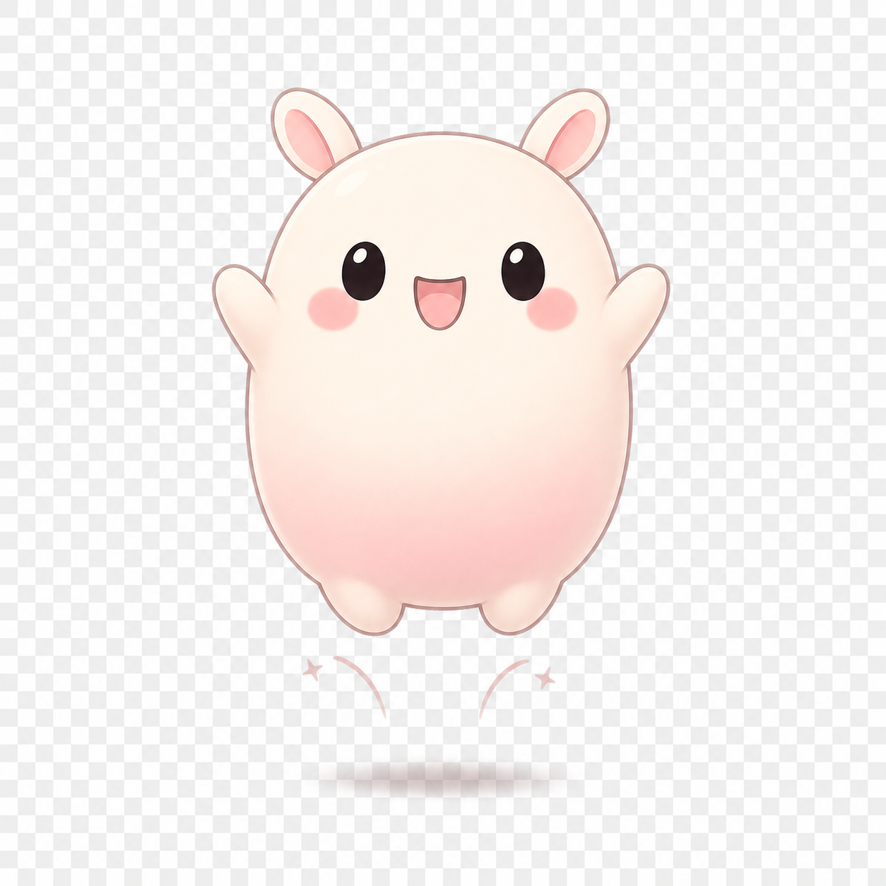
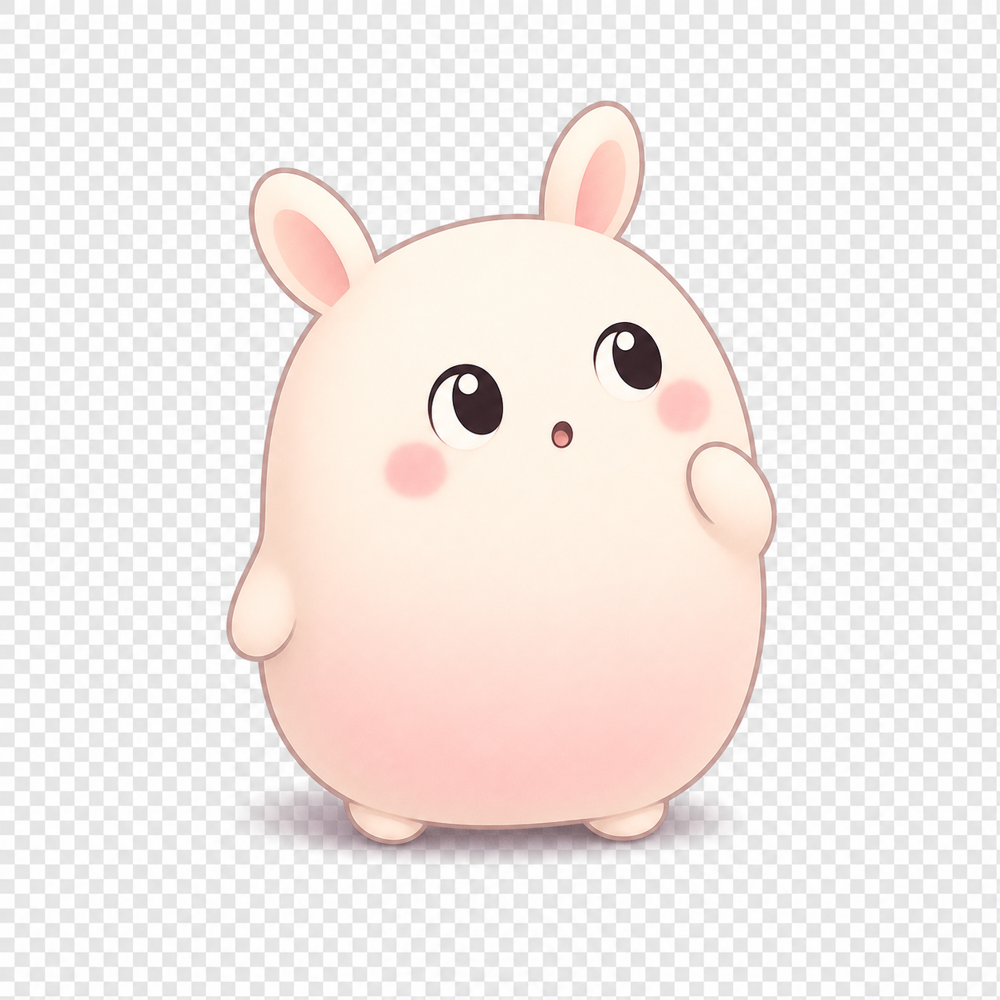

<div align="center">

# 🍡 Pet Mochi

**A local-first AI digital pet that lives on your desktop.**

Mochi moves on her own, remembers what matters, and chats briefly through an
optional local LLM. Works fully offline. No accounts. No cloud. No telemetry.

[](#license)
[](https://tauri.app)
[](https://svelte.dev)
[](https://www.rust-lang.org)
[](#run-tests)


<br />

<table>
  <tr>
    <td align="center"><br /><sub>idle</sub></td>
    <td align="center"><br /><sub>walk</sub></td>
    <td align="center"><br /><sub>jump</sub></td>
    <td align="center"><br /><sub>sit</sub></td>
    <td align="center"><br /><sub>look</sub></td>
    <td align="center"><br /><sub>sleep</sub></td>
  </tr>
  <tr>
    <td align="center"><br /><sub>eat</sub></td>
    <td align="center"><br /><sub>yawn</sub></td>
    <td align="center"><br /><sub>roll</sub></td>
    <td align="center"><br /><sub>blush</sub></td>
    <td align="center"><br /><sub>hide</sub></td>
    <td align="center"><br /><sub>celebrate</sub></td>
  </tr>
</table>

<sub>14 hand-drawn poses + per-mood color tint + 4 distinguishing glyphs<br />(🍡 hungry · … bored · ♡ lonely · ? curious)</sub>

</div>

---

## Why Pet Mochi

Most AI companions are chatbots wearing a mascot. Most virtual pets are cute
shells with no memory. Mochi is a deliberate middle path:

- **Alive without the LLM.** A deterministic local simulation drives mood,
  needs, movement, sleep, and idle behavior — every 3 seconds, all day, no
  network calls.
- **LLM only at salience moments.** Short greetings, daily reflections, and
  memory extraction. Hard cooldowns prevent spam and bills.
- **Memory you can read and delete.** SQLite + FTS5, ranked by importance ×
  recency × confidence. Export to Markdown anytime.
- **Sandbox by default.** Mochi can read files you drop into her inbox *only*
  after explicit per-file consent — never your filesystem at large.

> *"The pet must feel alive even when the LLM is off."* — Project North Star

---

## Install & Run

```bash
git clone https://github.com/cskwork/pet-mochi.git
cd pet-mochi
npm install
npm run tauri:dev          # launches the desktop pet
```

**Requirements**
- Node ≥ 20 · Rust ≥ 1.77
- Windows / macOS / Linux (Tauri 2 supported platforms)
- *Optional:* [Ollama](https://ollama.com/) for chat replies

That's it. Mochi happily runs in silent mode — no setup needed for the
core experience.

---

## What Mochi Can Do Today

- **Lives as a transparent always-on-top overlay** — drag her anywhere on the
  desktop, click-through hit-testing keeps the rest of your screen usable.
- **Animates 14 sprite states** — idle / walk / run / sleep / jump / sit /
  look-cursor / hide / celebrate / eat / yawn / roll / blush — driven by a
  pure-function state machine.
- **Mood you can read at a glance** — color tints + glyphs (🍡 hungry,
  … bored, ♡ lonely, ? curious) so similar mood tones stay distinguishable.
- **Tamagotchi-style actions** — Feed · Play · Pat · Rest · Report, each with
  multi-frame animation sequences.
- **Right-click → Close Mochi** — a tiny context menu since the overlay
  window is frameless.
- **Persistent memories** — durable preferences and recurring context survive
  restarts. Review, export, or delete from Settings.
- **Daily reflections** — once a day Mochi writes a short "dream" file
  summarizing what she learned and noticed.
- **File summaries with consent** — drop a `.txt` / `.md` / `.json` into the
  inbox; Mochi asks before reading it.
- **Optional Ollama chat** — short, mood-aware in-character replies. Hard
  cooldown, graceful fallback when the model is offline.

### Coming next (roadmap)

Voice · Custom skins · Live2D / VRM · Git/test-runner watcher · Local
embedding memory search · Multiple pets. See [`PRD.md`](./PRD.md) §24.

---

## Talking to Mochi (Optional)

Pet Mochi is happy in silent mode. To enable chat, install Ollama and pull
a small lightweight model:

```bash
ollama pull gemma4:e2b
```

Open Settings → set provider to `ollama`, point endpoint at
`http://localhost:11434` and choose a model (defaults to `gemma4:e2b`).
Mochi retrieves relevant memories, sends a compressed prompt, and stores
the interaction. A best-effort memory extraction job runs in the
background after each LLM-backed reply.

---

## Architecture

| Layer | Tech | Notes |
|---|---|---|
| Desktop shell | **Tauri 2** | Transparent, always-on-top, draggable overlay. |
| UI | **Svelte 5 + TypeScript** | PNG sprite + CSS animation, no extra renderer. |
| Simulation engine | TypeScript pure functions | Mood/decay/movement; testable, no LLM required. |
| Memory engine | **Rust + rusqlite + FTS5** | Durable memories, prefix search, weighted ranking. |
| LLM adapter | Rust + reqwest | Pluggable `LlmProvider` trait. **Ollama** is the first impl. |
| Sandbox | Rust | Inbox watcher (`notify`), path-jail safe IO, declarative skills. |

```
src/                       Svelte + TypeScript frontend
├─ App.svelte              Routes pet (default) and settings (#/settings)
├─ lib/
│  ├─ sim/                 Pure simulation engine (testable)
│  ├─ events/bus.ts        In-process event bus + salience-driven LLM gating
│  ├─ bridge/              Tauri invoke wrapper + typed API
│  └─ components/          Pet, MochiSprite, ChatBubble, PetActions, Settings
src-tauri/                 Rust backend
├─ src/
│  ├─ db.rs                SQLite schema, FTS5 search, CRUD
│  ├─ llm/                 Provider trait, Ollama, prompts, cooldowns
│  ├─ sandbox.rs           Pet home, safe file IO, skill manifests
│  ├─ watcher.rs           notify-based inbox watcher
│  ├─ commands.rs          Every #[tauri::command]
│  ├─ state.rs             Shared AppState (Arc<Db>, LLM, cooldowns)
│  └─ lib.rs               Tauri builder, plugin wiring, setup
```

### Design choices worth knowing

- **Simulation first.** A `runTick(state, ctx, elapsed)` pure function decides
  the pet's behavior every 3s. The LLM is consulted only when an event's
  salience clears 70 *and* a 90-second autonomous cooldown has passed.
- **Memory ranking.** FTS5 prefix search retrieves candidates; we re-rank by
  `0.4 × importance + 0.3 × recency + 0.3 × confidence` so old-but-important
  memories beat fresh trivia.
- **Failure first.** The pet keeps animating when the DB is unavailable, when
  Ollama is offline, when memory extraction returns garbage JSON. Failures
  log warnings instead of bubbling up to the UI.
- **Safety.** No `eval`, no shell, no remote skill loading. File paths are
  canonicalized and verified to live under the sandbox before any read/write.

---

## Sandbox

Mochi's home folder lives at:

| OS | Path |
|---|---|
| Windows | `%LOCALAPPDATA%\pet-mochi\` |
| macOS | `~/Library/Application Support/pet-mochi/` |
| Linux | `~/.local/share/pet-mochi/` |

Override with the `MOCHI_HOME` env var.

```
pet-mochi/
├─ inbox/      ← drop .txt / .md / .json files here
├─ notes/      ← Mochi writes summaries
├─ dreams/     ← daily reflections
├─ exports/    ← memory exports (Markdown / JSON)
└─ mochi.db    ← SQLite memory + state
```

Mochi never reads files outside `inbox/`, never writes outside `notes/`,
`dreams/`, or `exports/`, never executes shell commands, and refuses paths
containing `..`, absolute escapes, or symlinks that resolve outside the
sandbox.

---

## Development

### Run tests

```bash
npm test                                 # 99 frontend simulation tests (vitest)
cd src-tauri && cargo test --lib         # 41 backend tests (db, sandbox, llm, prompts)
```

### Type-check & build

```bash
npm run check          # svelte-check
npm run build          # vite frontend bundle
npm run tauri:build    # full desktop installer (icons already generated)
```

### Project decisions

See [`DECISIONS.md`](./DECISIONS.md) for the rationale behind recent UX/a11y
improvements, and [`BACKLOG.md`](./BACKLOG.md) for deferred items.

---

## PRD coverage

Every numbered requirement (REQ-001 … REQ-093) from [`PRD.md`](./PRD.md) is
implemented or explicitly out-of-scope for the MVP. Highlights:

- ✅ Transparent always-on-top draggable overlay (REQ-001…005)
- ✅ Idle / walk / sleep / jump / sit / look_cursor / celebrate / hide / run animations (REQ-010)
- ✅ Deterministic simulation, LLM-free movement (REQ-011…013)
- ✅ Hidden stats with decay & recovery (REQ-020…024)
- ✅ Event bus with salience scoring & LLM cooldown (REQ-030…033, §14.1)
- ✅ Provider trait (`LlmProvider`) — Ollama default, swappable (REQ-040…044)
- ✅ Short, mood-aware chat replies with graceful fallback (REQ-050…054)
- ✅ SQLite + FTS5 memory store, recency × importance × confidence ranking (REQ-060…066)
- ✅ Daily reflection (LLM optional; deterministic fallback) → `dreams/` (REQ-070…073)
- ✅ Pet home folder with `inbox/`, `notes/`, `dreams/`, `exports/` (REQ-080…084)
- ✅ Declarative skill manifests, no remote skill installation (REQ-090…093)

Out of scope for MVP (per PRD §4.2): voice, 3D/Live2D, browser automation,
shell execution, cloud sync, marketplace plugins.

---

## Contributing

Issues and PRs welcome. Before opening a PR:

- Run `npm test` and `cd src-tauri && cargo test --lib` — both must pass.
- Run `npm run check` — must be 0 errors / 0 warnings.
- For UI changes, smoke-test in `npm run tauri:dev` and describe what you
  saw in the PR description.
- Match the existing simulation-first principle: **the pet must feel alive
  even when the LLM is off.**

---

## License

[MIT](LICENSE) — do whatever you want, no warranty.

If Pet Mochi made your day a little nicer, ⭐ the repo. That's all.
